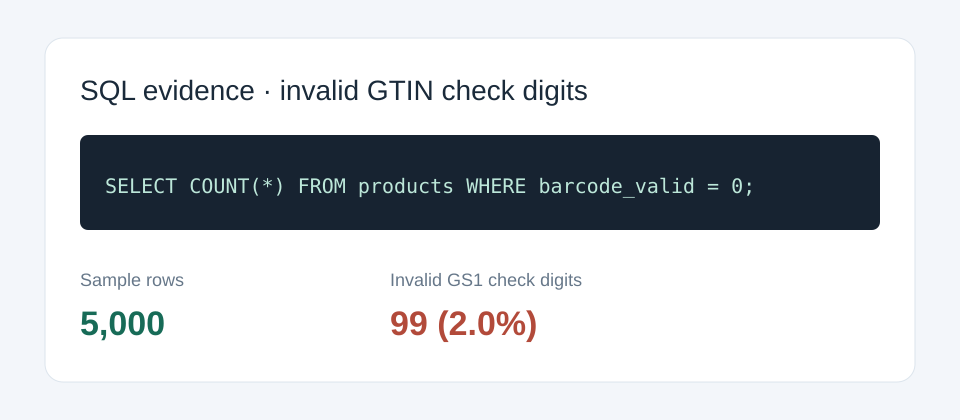

# Issue report: 99 sampled product barcodes fail GS1 Mod-10

**Steps / evidence**

Run `python scripts/analyze.py` after loading the database. Query: `SELECT COUNT(*) FROM products WHERE barcode_valid = 0;` Result: **99 of 5,000** sampled records. The validator in `app/data.py` applies the GS1 Mod-10 check digit to 8, 12, 13 and 14 digit GTINs.

**Expected vs actual**

Expected: every barcode is validated and invalid values are clearly flagged before external lookup or record matching. Actual: this sample contains the above invalid values; live lookups cannot reliably match them and downstream joins may fail or misattribute product data.

**Screenshot**

**Impact**

99 sample records. Cost assumption if left for 90 days: one manual review of 2 minutes per invalid record costs 3.3 staff hours; unresolved joins also risk bad product details for catalog teams and shoppers. This is an estimate, not measured operational loss.
